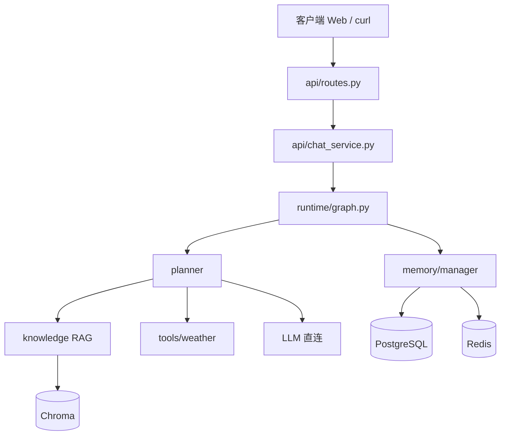

# legal_assistant 源码说明

本目录是 **法律智能助手** 的后端核心代码包。对外提供 REST API 与 SSE 流式对话，内部通过 LangGraph 编排「意图识别 → 法律 RAG / 天气工具 / 通用聊天 → 记忆保存」的完整流程。

> 项目根目录的 [README.md](../../README.md) 侧重安装、Docker 与命令行；**本文档侧重代码结构**，适合新手阅读源码。

---

## 一、这个项目做什么？

用户发送一条消息（例如「劳动合同试用期最长多久？」），系统会：

1. **识别意图**：法律 / 天气 / 通用闲聊
2. **执行对应能力**：
   - 法律：从 Chroma 向量库检索法条 → 拼 Prompt → 调用 DeepSeek 生成回答 + 引用来源
   - 天气：调用 Open-Meteo 等 API → 格式化回答
   - 通用：直接调用大模型对话
3. **保存会话**：写入 PostgreSQL，并缓存到 Redis
4. **返回结果**：JSON 或 SSE 流式输出；Web 前端在 `web/` 目录

---

## 二、目录结构

```
legal_assistant/
├── main.py              # 应用入口：FastAPI 创建、生命周期、挂载 Web UI
├── config.py            # 全局配置（.env / 环境变量）
│
├── api/                 # HTTP 接口层
│   ├── schemas.py       # 请求/响应 Pydantic 模型
│   ├── routes.py        # 路由：/chat、/sessions、/health 等
│   └── chat_service.py  # 聊天业务逻辑 + SSE 事件生成
│
├── planner/             # 意图规划（路由到 legal / weather / general）
│   ├── intent.py        # 关键词规则分类
│   └── router.py        # 规则 + LLM 兜底分类
│
├── runtime/             # Agent 运行时（LangGraph 状态图）
│   ├── state.py         # AgentState：图节点间传递的状态
│   ├── graph.py         # 构建 StateGraph、条件边
│   └── nodes.py         # 各节点实现：planner / legal / weather / general / save_memory
│
├── memory/              # 多轮对话记忆
│   ├── models.py        # SQLAlchemy 表：sessions、messages
│   ├── database.py      # 异步数据库引擎
│   ├── redis_store.py   # Redis 热缓存
│   ├── postgres_store.py# PostgreSQL 持久化
│   └── manager.py       # 统一读写接口（先 Redis 后 PG）
│
├── knowledge/           # 法律知识 RAG
│   ├── chroma_client.py  # Chroma 向量库客户端
│   ├── ingest.py        # 法律 Markdown → 分块 → 嵌入 → 入库
│   ├── retriever.py     # 相似度检索
│   └── legal_qa.py      # 法律 Prompt 构建、引用格式化、免责声明
│
├── tools/               # 可插拔工具
│   ├── base.py          # WeatherResult、WeatherAdapter 协议
│   ├── registry.py      # 按配置选择天气适配器
│   └── weather/         # open_meteo（已实现）、qweather / gaode（占位）
│
├── observability/       # 可观测性
│   ├── langfuse_client.py # Langfuse 客户端（链路追踪）
│   ├── tracing.py       # trace_chat、span 装饰器
│   └── metrics.py       # Prometheus 指标
│
└── evaluation/          # 离线评测（CI / 基准测试）
    ├── rag_metrics.py   # RAG Recall@K
    ├── llm_judge.py     # LLM 评审法律回答质量
    └── agent_benchmark/ # 端到端 Agent 基准任务与报告
```

---

## 三、一次请求的完整链路

```
浏览器 / curl
    │
    ▼
main.py (FastAPI)
    │
    ▼
api/routes.py  ── POST /api/v1/chat 或 /api/v1/chat/stream
    │
    ▼
api/chat_service.py
    │  ① memory.manager.load(session_id)     读历史
    │  ② runtime.graph.ainvoke(...)            跑 LangGraph
    │  ③ memory 在 graph 内 save_memory 节点  写本轮
    │
    ▼
runtime/graph.py
    │
    ├─ planner 节点     → planner/router.py 分类 intent
    │
    ├─ legal 节点       → knowledge 检索 + LLM
    ├─ weather 节点     → tools/weather 查询
    └─ general 节点     → 直接 LLM
    │
    └─ save_memory 节点 → memory/manager 持久化
    │
    ▼
ChatResponse / SSE 事件流 返回客户端
```

**建议新手按此顺序阅读源码：**

`config.py` → `main.py` → `api/routes.py` → `api/chat_service.py` → `runtime/graph.py` → `runtime/nodes.py`

---

## 四、各模块职责速查

| 模块 | 一句话说明 | 关键文件 |
|------|------------|----------|
| **config** | 读 `.env`，统一管理 API Key、数据库地址等 | `config.py` |
| **api** | 对外 HTTP 接口，不含业务细节 | `routes.py`, `chat_service.py` |
| **planner** | 判断用户想干什么 | `intent.py`, `router.py` |
| **runtime** | LangGraph 编排执行流程 | `graph.py`, `nodes.py`, `state.py` |
| **memory** | 多轮对话上下文 | `manager.py` |
| **knowledge** | 法律文档 RAG | `ingest.py`, `retriever.py`, `legal_qa.py` |
| **tools** | 外部 API 工具（天气等） | `registry.py`, `weather/open_meteo.py` |
| **observability** | 日志追踪与监控 | `tracing.py`, `metrics.py` |
| **evaluation** | 自动化测试与质量评估 | `agent_benchmark/` |

---

## 五、核心概念（新手向）

### 1. LangGraph 状态图

- **节点（node）**：一个 async 函数，读 `AgentState`，返回要更新的字段
- **边（edge）**：决定下一个节点；`graph.py` 里用 `route_by_intent` 按 `intent` 分支
- **状态（state）**：见 `runtime/state.py`，包含 `session_id`、`messages`、`intent`、`answer`、`citations` 等

### 2. RAG（检索增强生成）

法律问题不会让模型「凭空编造」：

1. `retriever.py` 用用户问题去向量库搜相关法条片段
2. `legal_qa.py` 把片段拼进 Prompt
3. LLM 基于片段回答，并返回 `citations`（引用来源）

### 3. 双层记忆

| 层 | 技术 | 作用 |
|----|------|------|
| 热缓存 | Redis | 快速读最近 N 轮对话 |
| 持久化 | PostgreSQL | 会话长期保存、重启不丢 |

读：Redis 命中则直接返回；未命中则查 PG 并回填 Redis。  
写：先写 PG，再截断到 `max_history_turns` 轮，写入 Redis。

### 4. SSE 流式响应

`POST /api/v1/chat/stream` 返回 `text/event-stream`，事件类型包括：

| 事件 | 含义 |
|------|------|
| `status` | 处理中提示（如「正在检索法律文档…」） |
| `session` | 会话 ID、trace ID |
| `intent` | 识别出的意图 |
| `citations` | 法律引用（RAG 时） |
| `delta` | 回答文本片段（打字机效果） |
| `disclaimer` | 法律免责声明 |
| `done` | 结束 |

同步 JSON 接口：`POST /api/v1/chat`（非流式，一次返回完整 `ChatResponse`）。

---

## 六、主要 API 端点

| 方法 | 路径 | 说明 |
|------|------|------|
| POST | `/api/v1/chat` | 同步聊天（JSON） |
| POST | `/api/v1/chat/stream` | 流式聊天（SSE） |
| GET | `/api/v1/sessions/{id}` | 获取会话历史 |
| DELETE | `/api/v1/sessions/{id}` | 删除会话 |
| POST | `/api/v1/knowledge/reindex` | 重建法律向量索引 |
| POST | `/api/v1/feedback` | 用户反馈 → Langfuse |
| GET | `/health` | 健康检查 |
| GET | `/metrics` | Prometheus 指标 |
| GET | `/` | Web 聊天界面（需 `web/dist` 已构建） |

---

## 七、配置与环境变量

配置定义在 `config.py`，通常通过项目根目录 `.env` 注入。常用项：

| 变量 | 说明 |
|------|------|
| `DEEPSEEK_API_KEY` | 大模型 API 密钥（必填） |
| `DATABASE_URL` | PostgreSQL 连接串 |
| `REDIS_URL` | Redis 连接串 |
| `CHROMA_HOST` / `CHROMA_PORT` | 向量库地址 |
| `LANGFUSE_ENABLED` | 是否开启链路追踪 |
| `SKIP_AUTO_INGEST` | 启动时是否跳过自动入库 |

**本地开发注意：** 在本机直接 `uvicorn` 时，`.env` 里数据库/Redis/Chroma 主机名应写 `localhost`；在 Docker Compose 内跑 API 时写服务名 `postgres` / `redis` / `chroma`。

---

## 八、本地启动（开发）

```bash
# 1. 启动基础设施
docker compose up -d postgres redis chroma

# 2. 启动 API（项目根目录）
source .venv/bin/activate
uv run uvicorn legal_assistant.main:app --reload --port 8000

# 3. 启动前端（可选，开发模式）
cd web && npm run dev   # http://localhost:5173
```

首次使用法律 RAG 需入库：

```bash
curl -X POST http://localhost:8000/api/v1/knowledge/reindex
```

---

## 九、测试

```bash
# 单元测试（不含慢速 LLM 调用）
uv run pytest tests/unit -m "not slow and not benchmark" -v

# API 集成测试
uv run pytest tests/integration -v
```

测试里常用 `create_app(..., skip_db_init=True, mount_web_ui=False)` 并注入 mock 的 LLM / 检索器，避免依赖真实外部服务。

---

## 十、扩展指南

| 想做什么 | 建议改哪里 |
|----------|------------|
| 新增 API 接口 | `api/schemas.py` + `api/routes.py` |
| 新增意图类型 | `planner/intent.py`、`router.py`，以及 `runtime/graph.py` 增加节点与边 |
| 换天气数据源 | 实现 `tools/weather/` 下新适配器，在 `registry.py` 注册 |
| 换大模型 | `config.py` + `runtime/nodes.py` 的 `create_llm()` |
| 调整 RAG | `knowledge/ingest.py`（分块）、`retriever.py`（检索参数） |
| 加监控指标 | `observability/metrics.py` |

---

## 十一、相关目录（本包之外）

| 路径 | 说明 |
|------|------|
| `web/` | React 聊天前端 |
| `profile/legal/` | 法律 Markdown 语料 |
| `scripts/` | 文档下载、入库、trace 导出等脚本 |
| `tests/` | 单元 / 集成 / 评测测试 |
| `docs/superpowers/specs/` | 产品设计规格 |

---

## 十二、架构示意图



---

如有疑问，可从 **`main.py` 的 `create_app`** 和 **`runtime/graph.py` 的 `build_agent_graph`** 两处打断点，发送一条聊天请求，逐步跟读调用栈。
